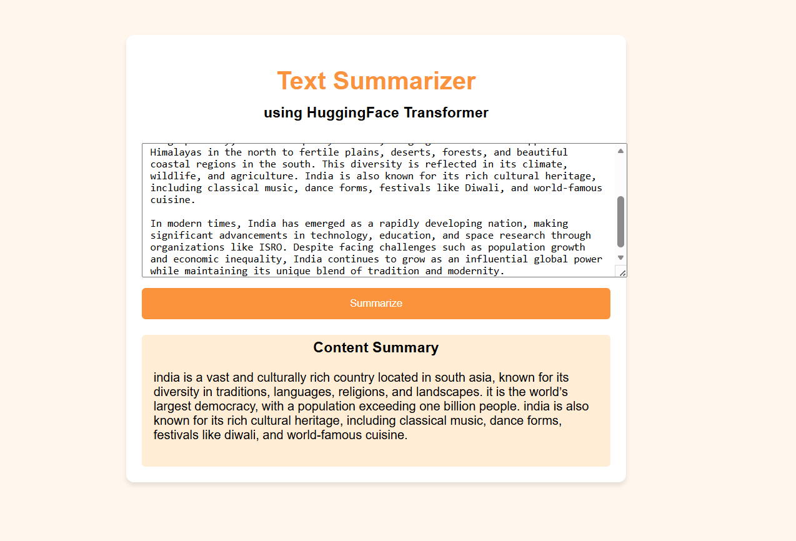

# 🚀 SummarAI: Context-Aware Dialogue Summarization System



> Fine-tuned T5 model for dialogue summarization with FastAPI deployment.

---

## 📌 Overview

SummarAI is an end-to-end NLP system that generates concise summaries from long dialogues using a fine-tuned T5 transformer model.  
It is deployed as a FastAPI-based REST API for real-time summarization.

---

## ✨ Features

- Fine-tuned T5 Transformer for abstractive summarization  
- Handles long dialogue inputs (up to 512 tokens)  
- FastAPI deployment for real-time inference  
- Clean preprocessing pipeline  
- GPU/CPU support using PyTorch  

---

## 🛠️ Tech Stack


---


---

## ⚙️ Installation

```bash
git clone https://github.com/your-username/summarAI.git
cd summarAI
pip install -r requirements.txt
```

---

## ▶️ Run the App

```bash
uvicorn app:app --reload
```

Open in browser:  
http://127.0.0.1:8000

---

## 📡 API Endpoint

### POST `/summarize/`

#### Request
```json
{
  "dialogue": "Your long dialogue text here..."
}
```

#### Response
```json
{
  "summary": "Generated short summary..."
}
```

---

## 🧠 Model Details

- Model: T5 (Text-to-Text Transfer Transformer)  
- Fine-tuned for dialogue summarization  
- Max input length: 512 tokens  
- Beam search decoding (num_beams=4)  

---

## 🖼️ Demo

Above screenshot shows the working UI and summarization output.

---

## 🤝 Contributing

Contributions are welcome! Feel free to fork and improve.

---

## 👨‍💻 Author

**Abhishek Marigeri**

---

⭐ If you like this project, give it a star!
